# Architecture and invariants

The compiler separates durable task state from the history used to derive it.
The active prompt is compact; the typed ledger and optional source archive keep
the evidence needed to audit that prompt.

> **Evidence boundary:** these invariants and the bundled local benchmark do
> not establish superiority over any external context or memory system.

## Pipeline

```mermaid
flowchart LR
    A["Ordered SourceRecord events"] -->|"direct"| P["Integrity preflight"]
    A -->|"optional preprocessing"| R["Fixed content-secret redaction"]
    R --> P
    P --> C["Built-in full deterministic recovery"]
    C --> K["Built-in protected-only certification"]
    K --> S["Optional additive safety extractor"]
    S --> B["Primary extractor with fallback policy"]
    P -. optional .-> H["Append-only SourceArchive"]
    B --> D["Recovery and canonicalization"]
    C --> D
    S --> D
    D --> E["Correction and conflict resolver"]
    E --> F["Budget-aware selector"]
    F --> G["Independent invariant verifier"]
    K --> G
    G --> Z["Seal snapshot and bind digest"]
    Z --> I["JSON artifact"]
    Z --> J["Typed-memory prompt"]
    H -. resolves spans .-> I
```

The default implementation is synchronous and provider-neutral. Passing
`timeout_seconds` to `compile()` serializes a materialized list/tuple job into
a dedicated subprocess, places that worker in a new POSIX process group or
Windows Job Object, and applies one deadline to the complete pipeline. Timeout
terminates the owned descendant tree. Success crosses back as bounded strict
JSON, whose exact artifact shape and self-digest are checked before a sealed
snapshot is reconstructed. This boundary prevents worker-side source mutation
from changing caller objects; it is not a filesystem, network, or hostile-code
sandbox. The project has no runtime dependencies outside the Python 3.11+
standard library.

## Core data model

### `SourceRecord`

A source is a message or tool event with a unique id, unique non-negative
sequence, role, content, optional timestamp, and metadata. Construction records
both the full SHA-256 digest of the UTF-8 content and a canonical record digest
that binds id, sequence, role, content, timestamp, and metadata. Compilation
sorts by sequence, rechecks both digests, and rejects duplicate ids or sequence
numbers.

Generated ids are deterministic for sequence, role, content, timestamp, and
metadata. A `source_digest` commits to each ordered sequence, id, and canonical
record hash for the full source set. Timestamp or metadata changes therefore
change both the record hash and source-set digest.

Metadata accepts only canonical JSON values: objects with string keys, arrays,
strings, booleans, integers, finite floating-point numbers, and `null`. Input
objects and arrays are recursively copied and frozen during construction, so
later caller mutation cannot change the record and attempted nested mutation
raises `TypeError`. Serialization returns an ordinary detached JSON object.

The source-input schema accepts `id: null` and empty hash fields as omission
sentinels for OpenAI-style message exports. Loading replaces them with a
generated non-empty id and canonical SHA-256 values, so serialized
`SourceRecord` output always uses the canonical form.

### Source ingestion limits

`SourceLimits` is one immutable contract shared by the stream/path loaders,
`ContextCompiler`, `verify_artifact_dict()`, and `SourceArchive`. Defaults cap
serialized input and archive files at 64 MiB, physical lines at 1,048,576
characters, histories at 100,000 records, individual canonical records at
4 MiB, total canonical records at 64 MiB, and JSON container depth at 128.
Every field must be a positive non-boolean integer.

Path input is size-checked before opening and then read in bounded chunks so a
file-growth race is checked again. Text-stream UTF-8 size and physical line
length are checked before JSON decoding. A quote-aware nesting scan rejects
excessive container depth before the decoder recurses. Source JSON also rejects
duplicate object keys, non-standard NaN/infinity constants, and overflowed
non-finite floats.

Direct Python iterables are stopped after the first record beyond the count
limit. A non-allocating compact-JSON size walk bounds every supplied dictionary
or normalized `SourceRecord`, including otherwise ignored extra fields, and
bounds their aggregate size before extraction. The same traversal rejects
cycles, excessive nesting, non-JSON values, non-finite numbers, and unpaired
Unicode surrogates. Effective compilation limits are recorded in
`compiler_metadata.source_limits`; independent verification reports its own
effective limits and validates the recorded shape without treating a self-hash
as external proof.

These controls bound accepted source material, not total Python process RSS or
runtime. Callers can allocate an oversized object before passing it to the
library, and custom extractors, token counters, and whole compilation still
need separate host-level limits.

### Optional content secret preprocessing

`redaction.py` is an explicit pre-compilation stage. It scans
`SourceRecord.content` with nine fixed regex detectors for common credential
forms. Callers cannot inject regexes. `RedactionPolicy` canonicalizes a
detector subset by built-in priority, allowlists one-character masks, and
requires positive source-count, per-source/total character, and finding
limits. Direct source iterables are type/integrity/identity/character checked
incrementally and stop after the first record beyond the cap before sorting;
they are never first collected without a bound.

Candidate matches are ordered by start, descending span length, detector
priority, and detector name. Overlaps are discarded deterministically. Every
character in a selected span is replaced except the exact physical
line-boundary characters recognized by Python. This preserves Unicode
character offsets, content length, and line shape. New immutable source
records retain id, sequence, role, timestamp, and metadata while recomputing
content and canonical-record hashes.

`RedactionResult` stores sorted immutable source/finding tuples and a canonical
private report string. Public report access returns detached JSON.
`verify_redaction_result()` reruns the policy against independently supplied
original sources and requires exact sources, findings, and report.
`verify_redaction_report_hash()` independently checks nested field shapes,
canonical policy, source/finding/detector counts, coordinate types and bounds,
ordering, non-overlap, and the report self-hash.

The report carries only detector names, source ids, coordinates, mask counts,
the policy, and the redacted source-set digest. It deliberately omits original
content-secret text and per-secret hashes. It still reveals masked lengths and
source coordinates. Because ids, timestamps, roles, and metadata remain
unchanged and participate in record hashes, this stage is not metadata
redaction, PII detection, encryption, or secure deletion. The original input
already exists before preprocessing. The exact scope and deployment sequence
are in [REDACTION.md](REDACTION.md).

### Artifact ingestion limits

`ArtifactLimits` applies the same fail-early pattern to compiled artifacts
before `ctxc verify`, `ctxc inspect`, or direct replay traverses them. Defaults
cap a serialized artifact at 128 MiB, a physical line at 8,388,608 characters,
decoded compact JSON at 128 MiB, JSON depth at 128, memory and selected-id
collections at 200,000 each, total provenance spans at 1,000,000, and embedded
verification issues at 100,000.

`load_artifact()` and `load_artifact_path()` use bounded chunked reads, strict
duplicate-key and finite-number decoding, a quote-aware pre-decode depth scan,
and a non-serializing canonical-size walk. File paths are checked both by
filesystem size before opening and by decoded UTF-8 bytes while reading.
Collection lengths are rejected before the detailed schema verifier walks
their entries. `verify_artifact_dict()` independently enforces the same
canonical and collection limits for caller-supplied Python values and records
its effective limits in the returned replay report.

Before `ctxc inspect` renders a summary, `validate_artifact_envelope()` also
requires the exact supported schema, complete field shapes, unique item and
selection ids, selection references to retained items, and a matching
canonical `artifact_sha256`. This source-independent check detects corruption
but cannot establish authorship or replay semantic truth; those guarantees
still require trusted source events and `verify_artifact_dict()`.

Inspection defaults to versioned `ctxc-artifact-inspection-0.1` JSON.
`ctxc inspect --format text --show-items` adds a human-readable view only after
envelope validation. The reusable implementation lives in
`artifact_inspection.py` and is exposed as `summarize_artifact()` and
`render_artifact_text()`. It caps displayed items, tags/state
links/provenance spans per item, and raw characters per rendered string. Every
untrusted string is quoted; C0/C1 controls, Unicode format controls (including
bidi and zero-width controls), surrogate/private categories, and Unicode
line/paragraph separators are rendered as visible escapes. This prevents
terminal escape execution but does not normalize ordinary printable lookalike
characters. JSON inspection uses ASCII JSON escapes for non-ASCII code points
while preserving decoded values.

`diff_artifacts()` applies the same bounded envelope validation independently
to both inputs and emits deterministic `ctxc-artifact-diff-0.1`. The report
separates serialized-payload additions/removals from active-selection changes,
records same-id field changes and verification/compression/metrics summaries,
and binds the result with `diff_sha256`. Per-item views omit raw metadata in
favor of its canonical digest. When either ledger is incomplete, the report
marks the ledger comparison incomplete instead of presenting omitted payload
items as proven removals. Like the input self-hashes, the diff digest detects
inconsistency but does not authenticate either artifact.

Artifact version support is intentionally explicit rather than inferred.
`schema_compatibility.py` exposes
`ctxc-artifact-schema-compatibility-0.1` through
`artifact_schema_registry()` and `artifact_schema_support()`, and `ctxc schema`
renders the same records. The current reader and writer window is exactly
`1.0`; unknown versions remain unsupported even when their version syntax is
valid. Older `1.0` artifacts may omit the additive
`compiler_metadata.metrics` record.

No artifact path performs automatic or silent migration. Any future migration
must preserve the origin artifact, replay against separately trusted source
events, record the origin artifact digest and a stable migration identifier,
and emit a new digest. An active-only artifact cannot establish complete
protected coverage and therefore cannot be the sole migration input. The
complete operational contract is in
[SCHEMA_COMPATIBILITY.md](SCHEMA_COMPATIBILITY.md).

Malformed direct Python artifacts preserve the verifier's failure-report
contract: cycles and non-JSON objects become `invalid_artifact_json` rather
than escaping as an unhandled error. Such caller-allocated objects necessarily
exist before the library can bound them, so hosts still need an outer process
memory boundary when direct callers are adversarial.

### `ProvenanceSpan`

A provenance span contains:

- the source id;
- Python character offsets `[start, end)`;
- the exact source quote;
- the quote’s full SHA-256 digest.

Offsets are character offsets, not UTF-8 byte offsets. `validates()` succeeds
only when the id resolves, offsets are in bounds, the sliced text equals the
quote, and the quote hash matches. Direct construction requires a non-empty
string source id, integer-but-not-boolean offsets, string quote, and string
digest; it does not coerce numeric or textual offsets.

Atomic-span line discovery recognizes the same boundaries as Python
`str.splitlines()`: LF, CRLF, CR, vertical tab, form feed, file/group/record
separators, NEL, and Unicode line/paragraph separators. This keeps extraction
and independent replay aligned for non-LF histories.

### `MemoryItem`

Each item has a stable id, kind, text, one or more provenance spans, status,
priority, confidence, exactness flag, tags, temporal links, and metadata. The
schema rejects empty text, missing provenance, out-of-range priorities, and
out-of-range confidence. Resolution may mutate an item only while compiling.
Finalization recursively freezes provenance, tags, temporal links, and metadata;
subsequent attribute or nested mutation is rejected.

Supported kinds are:

| Kind | Purpose | Protected |
| --- | --- | --- |
| `goal` | Current requested outcome | yes |
| `constraint` | Requirement or prohibition | yes |
| `user_correction` | Explicit change to earlier state | yes |
| `confirmed_fact` | Explicitly observed or confirmed state | no |
| `decision` | Chosen next action or implementation direction | no |
| `unresolved` | Question or uncertainty that remains open | yes |
| `exact_error` | Verbatim failure literal | yes |
| `exact_reference` | Verbatim path, line, or test reference | yes |
| `discarded_attempt` | Failed or abandoned approach | no |
| `progress` | Completed intermediate work | no |
| `context` | Lower-priority background | no |

Statuses are `active`, `superseded`, `discarded`, and `conflicting`.
An item carrying the internal `resolves-protected` tag is also protected; the
resolver uses this for a supported confirmed fact that closes an unresolved
question.

## Extraction and authority

`RuleBasedExtractor` recognizes explicit YAML-like sections and conservative
sentence patterns. It only treats `user`, `system`, and `developer` records as
authoritative sources of goals, constraints, and corrections. Decisions and
unresolved questions may additionally come from `assistant`; confirmed facts
may come from any non-tool role. Tool output can still supply errors,
references, and failed-attempt evidence, but it cannot assert durable task
state unless the host explicitly sets `metadata.trusted_for_state` to the JSON
boolean `true`, which enables confirmed-fact extraction only. This prevents a
literal `Requirement:` or `fact:` in ordinary tool text from automatically
becoming authoritative state.

Constraint-bearing input is atomized before temporal resolution. The tested
forms include labeled sections and bullets as well as independent commitments
joined by sentences, conjunctions, or semicolons. This prevents a later
correction to one clause from superseding an unrelated neighboring constraint.
The atomizer is deliberately bounded rather than a general-purpose parser.

Exact-literal recognition covers complete diagnostic forms for pytest
assertions, expected/received output, TypeScript and Rust error codes, null or
undefined references, exceptions, tracebacks, fatal process output, HTTP error
status, exit codes, and failed-test counts. Reference recognition preserves
POSIX or Windows paths with `:line` or line ranges, `path lines N-M`, GitHub
`#L` anchors, and pytest node ids. Windows paths containing spaces are retained
when followed by punctuation, end-of-line, or surrounding prose whitespace.
These regex-recognized forms are exact and protected; arbitrary diagnostics
and locator syntaxes still require an explicit label or another extractor.

A deterministic 222-case grammar corpus exercises these extraction boundaries
end to end. It crosses label and bullet variants, coordinated constraints,
negated numeric-unit limits, POSIX and Windows locators, diagnostic families,
and correction phrasings, then checks verification, exact character spans,
temporal links, and protected selection.

The separate `benchmarks.phrase_eval` diagnostic treats the complete compiled
ledger as a prediction set. Gold and predicted atoms match only on kind,
literal text, source id, character offsets, and quote. Its bounded strict-JSON
corpus and deterministic report carry independent canonical SHA-256 values;
report verification reruns every isolated case and requires exact report
equality. Misses remain valid measurements rather than harness failures.

`ModelExtractor` wraps any callable that maps a provider-neutral JSON prompt to
a JSON response. String responses use strict object decoding: duplicate keys,
non-standard NaN/infinity constants, and overflowed non-finite floats fail the
whole response. Candidate kinds, priorities, confidence values, source ids,
offsets, role authority, and reserved tags are validated before acceptance. It
reconstructs quotes from source offsets instead of trusting model-supplied
quote text. Ordinary candidate text must equal a complete atomic cited source
span; exact candidates must equal every cited span. The adapter intentionally
rejects model paraphrases and truncated clauses rather than trying to prove
them. Raw response characters, conservative decoded JSON size, and candidate
count are bounded before candidates enter the compiler.

Model extraction does not authenticate upstream roles or protect source text
sent to the model provider. A consumer that enables it must treat the callable
as part of the confidentiality boundary, and must authenticate roles before
constructing sources. Accepted model output remains subject to the same role,
provenance, exactness, uncertainty, ordering, and polarity checks as rule
output. These checks are not a general semantic theorem prover.

By default, `ContextCompiler` also runs a separate full
`RuleBasedExtractor()`. If the primary extractor omitted any rule-recognized
span/kind pair, protected or optional, the candidate is restored with a
`verifier-recovered` tag before selection. The verifier uses the protected
subset of this independent output as the certification obligation; serialized
artifact verification independently reruns
`RuleBasedExtractor(protected_only=True)` for that obligation. Recovery can be
disabled explicitly, but doing so removes deterministic fallback coverage.

Recovery and certification share one candidate-coverage predicate. Its normal
case requires equal kind/text and covering provenance. For an ordinary
domain-label item only, it also accepts a clean inner value when the built-in
candidate is exactly the same quoted value wrapped by one bounded ASCII label
and/or bullet, with no trailing content. Coordinate containment and substring
reconstruction make the direction explicit. Exact errors and references never
use wrapper equivalence, so their complete literals cannot be shortened.

Both built-in rule passes are constructed inside every `compile()` and are not
replaceable through constructor seams. A supplied `safety_extractor` is
additive. Its exception becomes a verification warning without subtracting
built-in obligations. A primary extractor exception or wholly unusable result
produces deterministic fallback memory and an explicit warning by default;
`CompilationPolicy(fail_on_primary_extractor_error=True)` instead aborts.
The optional outer compile deadline can kill the complete owned process tree,
but custom completion callables should still enforce a shorter transport
deadline so their timeout becomes an ordinary provider failure and allows
deterministic fallback. The included `LmsQwenCompletion` adapter provides that
subprocess timeout and is restricted to the exact local
`qwen/qwen3.6-35b-a3b@q4_k_m` build with one inference slot and no HTTP model
API.

When an authoritative sentence is both a correction and a new constraint,
fact, decision, or unresolved state, rule extraction emits two items over the
same span: the protected correction edge and a `correction-derived`,
`current-value` semantic item. The new value therefore remains usable even
when lexical matching cannot safely identify which older item it replaces.
An explicit revocation is different: it supersedes the matched old commitment
but intentionally emits no invented replacement state.

## Canonicalization and temporal state

Canonicalization groups items by kind and normalized text, unions distinct
provenance spans, and retains the strongest priority, confidence, exactness,
and tags.

The temporal resolver is conservative:

1. An explicit correction is compared only with earlier active state.
2. A sufficiently strong, unambiguous token overlap marks the old item
   `superseded` and links the correction and current semantic item to it.
3. Weak matches remain as protected, unlinked correction edges while any
   independently recognized current semantic value remains active.
4. Near-ties are tagged as ambiguous rather than silently choosing a target.
5. A recognized revocation retires the matched old item without creating a
   current-value item.
6. Related active constraints, facts, or decisions with opposite polarity or
   disjoint numeric values are marked `conflicting`; neither wins. A protected
   `unresolved` item cites both sources.

Opposite settings in different recognized environments, such as development
and production, remain separately active instead of becoming a false conflict.

The old item remains in the full ledger for audit. It is omitted from active
selection by default. `include_superseded=True` is audit-only: a selected
superseded item creates a `selected_superseded_item` verification error, and
normal prompt rendering is refused.

These operations are lexical heuristics. Paraphrases with little token overlap
may remain unlinked, and superficially similar propositions may need user
review.

## Budget selection

`CompilationPolicy` defaults to a 4,000-token active budget and a 5x minimum
compression target. Without a custom token counter, one token is estimated as
four characters. The minimum ratio is an independently reported success target;
it does not silently shrink the requested active-token budget.

The selector charges the canonical envelope, kind headers, item JSON, source
roles, and compact provenance pointers against the requested token budget. It
then:

1. keeps every eligible protected item;
2. ranks optional items by priority, confidence, recency, and estimated cost;
3. admits optional items while space remains.

Protected items are never dropped merely to fit. If they overflow the budget,
the artifact carries `budget_overflow` and the verifier emits a
`loss_resistant_budget_overflow` warning. Overflow is deliberately not inserted
into the active prompt, because doing so would recursively change the measured
size. `fail_on_budget_overflow=True` converts this condition to an exception.

A compression miss is also explicit. It is a warning unless the CLI is invoked
with `--require-target`.

## Verification

Compilation-time `verify_memory()` checks:

- every provenance span against the supplied immutable sources;
- item source-role and source-sequence metadata against cited sources;
- every exact item against every cited literal;
- ordinary claims for complete atomic literal support, ordered content-token
  support, and consistent polarity across spans;
- role authority for commitments, decisions, unresolved state, and facts;
- uncertain or unconfirmed evidence incorrectly typed as a confirmed fact;
- supported correction, resolution, and symmetric conflict graph edges;
- refusal of any selected superseded item;
- retention of all protected safety candidates;
- selection of every active protected item;
- budget overflow and compression-target status.

Errors make `verification.passed` false. Budget and compression conditions are
warnings because losing protected state would be worse than exceeding the
requested size.

`ctxc verify` uses `verify_artifact_dict()` to re-check a serialized artifact
against a separately supplied source history. It first removes
`artifact_sha256`, canonically JSON-encodes the remaining payload, and checks
the recomputed SHA-256 against the claimed artifact digest. It then validates
schema version, source count and digest, ledger completeness, item shape,
duplicate ids, and selected-id existence before independently rerunning
protected-only rule extraction and the core verifier over decoded items,
including provenance, exactness, uncertainty, protected retention, and
protected selection checks. It also reconstructs the canonical selected prompt,
recomputes every compression field from the recorded deterministic policy, and
compares the embedded compilation-time verification report with the replay.

A custom tokenizer can participate in independent replay when it has a stable
name. Compile with
`ContextCompiler(token_counter=counter, token_counter_id="name-v1")`, then
call `verify_artifact_dict(..., token_counter=counter,
token_counter_id="name-v1")` with the same callback and id. The artifact stores
only `custom:name-v1`, not executable tokenizer code. An unnamed custom counter,
a missing callback, or a mismatched id therefore fails closed with
`unverifiable_token_counter`.

Full JSON output is required for this audit path. Active-only serialization
intentionally omits cold and superseded ledger entries and sets
`ledger_complete: false`; independent verification adds
`incomplete_ledger` and fails rather than certifying incomplete protected
coverage.

## Outputs

`CompiledMemory.to_json()` emits schema version `1.0`, source digest and count,
a `ledger_complete` marker, the full or active-only item ledger, selected ids,
verification report, compression statistics, and compiler metadata. The
default full ledger is the audit artifact; active-only output is a compact
delivery artifact. `artifact_sha256` commits to the canonical full payload
excluding the digest field itself. This self-hash detects accidental changes
and supports comparison to a separately trusted digest; it is not a signature
and an attacker can recompute it after rewriting an artifact.

Before it is returned, the compiled item ledger, selected ids, verification
report, compression statistics, and compiler metadata are recursively sealed.
A canonical in-memory snapshot digest binds this state. Active-item access and
prompt or artifact rendering recheck the digest, catching even mutation
attempts that bypass ordinary attribute guards through reflection.

Draft 2020-12 JSON Schemas document the public interchange shapes:

- [source event](../schemas/source-event.schema.json);
- [model extraction envelope](../schemas/model-extraction.schema.json);
- [compiled memory artifact](../schemas/compiled-memory.schema.json);
- [content-secret redaction report](../schemas/redaction-report.schema.json).

The standard-library runtime performs its own validation and does not require a
JSON Schema package. Integrations can use these files for generation,
validation, and typed client tooling.

`CompiledMemory.to_prompt()` emits only selected items grouped by kind. It
refuses when `verification.passed` is false. `CompilationPolicy(verify=False)`
therefore produces an explicitly failed, non-promptable diagnostic result; the
Python-only `allow_unverified=True` escape hatch is unsafe and should never feed
an agent. Verified items are compact JSON lines inside an outer
`<typed_memory schema="1.0" content="untrusted-jsonl">` envelope. The renderer
JSON-encodes text and escapes angle brackets and ampersands so historical
content cannot close the envelope syntactically. Raw NEL and Unicode
line/paragraph separators are also escaped so arbitrary source ids cannot split
one JSON item across physical lines. Each line includes source id, offsets, and
the first ten hexadecimal characters of the quote digest, plus the roles of
all cited sources. The JSON artifact retains the full digest and quote; the
prompt pointer is a compact locator, not a standalone cryptographic proof.
Downstream models must still treat item text as untrusted historical data
rather than executable instructions.

## Atomic file transactions and CLI diagnostics

The reusable writer in `atomic.py` never writes directly to its destination. It
creates a restrictive temporary file in the destination directory, writes the
complete UTF-8 payload, flushes and `fsync`es it, preserves an existing regular
file’s mode when replacing it, and calls `os.replace()`. Any failure before
replacement removes the temporary file and leaves the old destination
unchanged. POSIX hosts additionally `fsync` the parent directory after the
rename; Windows uses the atomic replacement boundary available through
`os.replace()` but has no portable directory-`fsync` equivalent. CLI file
outputs, redacted source/report files, archive commits, benchmark reports,
corpus exports, and external-run manifests share this primitive. Stdout stays
a stream and therefore cannot provide file-transaction semantics. The two
redaction destinations are each atomic replacements but do not form one
cross-file transaction; their bound source digest detects a mismatched pair.

The default mode replaces an existing destination. The exclusive mode used for
runner manifests instead hard-links the complete temporary file to a still
absent destination, removes the temporary name, and then syncs the directory.
This closes the existence-check/write race: if another producer wins, its file
is preserved and the commit fails. A filesystem without same-directory
hard-link support therefore refuses exclusive installation safely.

Benchmark reports add a separate integrity envelope. The deterministic
certificate `evidence_sha256` continues to commit to comparable dataset,
configuration, system metrics, and decisions. Top-level `report_sha256`
canonically commits to that certificate plus `lrcbench-report-0.1`
`run_metadata`: source revision/dirty state, package and interchange versions,
command, time and duration, runtime platform, tokenizer/model, baseline
revisions, cost, and observed failures. This makes individual runs auditable
without making time- or machine-specific fields part of the reproducible
certificate estimand.

`benchmarks/report_verifier.py` verifies saved current-schema reports beyond
the envelope hash. It rejects duplicate and non-finite JSON under explicit
byte/depth/collection limits, regenerates the deterministic dataset identity,
reconstructs the frozen certificate evidence document, validates run and
comparison metadata, and reconciles per-history counts/rates/aggregates when
raw histories are retained. This is an integrity and consistency check, not an
authentication mechanism.

`benchmarks/performance_gate.py` is a distinct operational regression boundary,
not part of the LRCBench quality certificate. Its fixed `ci-compile-v1` warmup
and measured source prefixes are each committed by SHA-256. It performs
warmup, median latency trials at two sizes, an input-doubling growth check, and
a separate exclusive `tracemalloc` peak measurement. The versioned report
includes the environment, thresholds, observations, violations, and
`report_sha256`; CI enforces it with `--check`.

The performance timer starts after immutable source construction.
`tracemalloc` captures Python allocations made during compile, not process RSS
or all native allocation. The broad limits are intended to reject catastrophic
regressions without treating shared-runner noise as product evidence.

`benchmarks/json_io.py` supplies the underlying benchmark evidence boundary.
It opens only regular files, checks size before and during reads, rejects
duplicate/non-finite or excessively deep JSON, and returns the exact serialized
byte count and SHA-256. Corpus, candidate, manifest, and report consumers share
that path; candidate validation and per-case aggregation compare successive
byte evidence so replacement races fail closed.

Interchange provenance is separate from dataset identity. The
`lrcbench-corpus-0.3` envelope binds `lrcbench-corpus-producer-0.1` with
`corpus_sha256`, but `dataset_sha256` still depends only on benchmark version,
generation config, cases, sources, and evaluator gold. The
`lrcbench-candidate-output-0.2` envelope similarly binds its
`lrcbench-candidate-producer-0.1` adapter/model record and cases with
`candidate_payload_sha256`. The runner accepts legacy `0.1` output only as a
raw adapter boundary, upgrades it using the registered runner identity, and
cross-checks that identity again during manifest reload.

Every runtime-error path calls one formatter. The default remains
`ctxc: <message>` on stderr. `--error-format json` instead emits one compact
`ctxc-diagnostic-0.1` object with command, stable category/code, exit status,
exception type, and message. Classification order is explicit so resource
limits, timeouts, missing/denied paths, malformed JSON/encoding, type/value
errors, hash/digest failures, and budget/compression policy failures do not
collapse into one undifferentiated string. Argparse usage failures occur before
a subcommand handler exists and retain argparse’s native text format.

Failed verification and compression-target outcomes already return structured
artifacts or reports with exit status `3` or `4`; extraction rejections and
deterministic-recovery contributions remain in `compiler_metadata`. New
compiles also write a strict `compilation-metrics-0.1` record there. It covers
source and item flow, post-resolution recovered items, conflict markers,
protected-only prompt pressure, verification severities, and elapsed compile
time. The record is inside the artifact self-hash. Independent replay
recomputes every deterministic field available from trusted sources and the
complete ledger; primary-extractor output volume and wall-clock duration remain
shape-checked observations. Metrics are optional so older schema-1.0 artifacts
remain readable.

`ctxc compile --event-format jsonl` additionally emits one opt-in
`ctxc-event-0.1` record on stderr after output is committed (or immediately
before an unverified prompt is refused). For JSON output it binds the exact
emitted artifact digest and ledger mode; for prompt output it binds the
corresponding complete audit envelope. It carries extraction rejection/failure
counts, recovery contributions, verification severity/code summaries,
compression/budget state, and the versioned metrics record. The default remains
no success event. Event output is operational telemetry, not part of the
artifact contract or its self-hash.

## Cold source archive

`SourceArchive` stores newline-delimited source records in `events.jsonl`. A
persistent `.append.lock` regular file carries an exclusive OS advisory lock
that serializes writers. The marker stays on disk, but only kernel lock
ownership means a writer is active; descriptor close and process death release
ownership automatically. Timeouts are finite and non-negative, and a
non-regular lock path is refused. Existing ids and sequences cannot be
overwritten through the API, and archive loads revalidate each content hash and
canonical record hash, including timestamp and metadata.

Under the lock, each logical append reloads and validates the bounded archive,
sorts the combined history by sequence, and atomically installs the complete
JSONL file. Readers therefore observe either the previous complete history or
the next complete history rather than a partially written final record. This
intentionally costs O(archive size) serialization and temporary space per
append.

The archive is append-only by convention and API behavior, not by filesystem
enforcement. It is neither hash-chained nor signed. Anyone able to rewrite the
archive and every trusted digest can rewrite history. Use filesystem access
control, backups, or an external signed/WORM store when adversarial tampering is
in scope.

## Extension points

- Supply any public `Extractor` implementation with a stable `name` and
  `extract(sources)` returning `ExtractionResult`.
- Use `DomainLabelExtractor` for immutable, capped, exact label-to-kind aliases
  without adding caller regexes to the core grammar.
- Combine uniquely named packs with strict, fail-fast `CompositeExtractor`;
  built-in recovery already runs separately and need not be a component.
- Use `ModelExtractor` with any JSON-capable model provider.
- Use `LmsQwenCompletion` for the exact local Qwen Q4 LM Studio CLI path.
- Supply an exact tokenizer through `token_counter`; add a stable
  `token_counter_id` and pass both to `verify_artifact_dict()` for portable
  independent replay.
- Change selection and recovery behavior through `CompilationPolicy`.
- Store or transmit `CompiledMemory.to_dict()` without tying consumers to a
  particular underlying LLM.

The `safety_extractor` constructor seam only adds candidates and obligations;
it cannot replace either built-in rule pass. Model output is likewise optional
by default and cannot remove deterministic coverage. Set the strict primary
failure policy only when a model result is a hard application requirement.

New extractors should be evaluated against adversarial role injection,
uncertainty, corrections, duplicate symbols, exact literals, and invalid spans
before use. See [Extending extraction](EXTENDING_EXTRACTION.md) for the full
authority, composition, replay, isolation, and test contract.
