# Architecture and invariants

The compiler separates durable task state from the history used to derive it.
The active prompt is compact; the typed ledger and optional source archive keep
the evidence needed to audit that prompt.

> **Evidence boundary:** these invariants and the bundled local benchmark do
> not establish superiority over any external context or memory system.

## Pipeline

```mermaid
flowchart LR
    L["Optional SourceEvent / JSONL connector"] --> M["Authority-safe immutable mapping"]
    M --> A
    A["Ordered SourceRecord events"] -->|"direct"| P["Integrity preflight"]
    A -->|"optional preprocessing"| R["Fixed content-secret redaction"]
    R --> P
    P --> C["Built-in full deterministic recovery"]
    C --> K["Built-in protected-only certification"]
    K --> S["Optional additive safety extractor"]
    S --> B["Primary extractor with fallback policy"]
    P -. optional .-> H["Append-only SourceArchive"]
    B --> D["Recovery and canonicalization"]
    C --> D
    S --> D
    D --> E["Correction and conflict resolver"]
    E --> F["Budget-aware selector"]
    F --> G["Independent invariant verifier"]
    K --> G
    G --> Z["Seal snapshot and bind digest"]
    Z --> I["JSON artifact"]
    Z --> J["Typed-memory prompt"]
    Z --> Q["Optional bound ContextBundle"]
    H -. resolves spans .-> I
```



The default implementation is synchronous and provider-neutral. Passing
`timeout_seconds` to `compile()` serializes a materialized list/tuple job into
a dedicated subprocess, places that worker in a new POSIX process group or
Windows Job Object, and applies one deadline to the complete pipeline. Timeout
signals the owned POSIX group or terminates the Windows Job. Success crosses
back as bounded strict JSON, whose exact artifact shape and self-digest are
checked before a sealed snapshot is reconstructed. This boundary prevents
worker-side source mutation from changing caller objects; it is not a
filesystem, network, or hostile-code sandbox. A POSIX child that leaves the
group is outside the termination boundary, and Linux group-signal success does
not prove that every member accepted the signal. The project has no runtime
dependencies outside the Python 3.11+ standard library.

## Optional LocalAI connector boundary

`connector.py` is an optional integration layer around the ordinary compiler,
renderer, verifier, inspector, and archive contracts. It has no import-time or
runtime dependency on a sibling project: `localai-contracts`, ZoomCache,
TokConductor, VRAM Compiler, and ExpertPack are not imported. Existing
`ContextCompiler` and `ctxc` paths behave as before when the connector is not
used.

The connector exposes exactly six operations:

| Operation | Result |
| --- | --- |
| `capabilities` | Protocol, transport, accounting, authority, checkpoint, and certificate capabilities |
| `ingest_source_events` | Immutable source records, source identity, live session state, and checkpoint |
| `compile_memory` | A bound `ContextBundle` and current checkpoint |
| `render_context` | Verified typed-memory text and its digest |
| `verify_memory` | Independent artifact replay plus connector-binding checks |
| `inspect_memory` | Bounded artifact summary, trusted-memory counts, bindings, accounting, and certificate |

The CLI entry point is `ctxc connector --stdio`. It reads sequential JSONL and
writes one response line for each nonblank request line. The strict request
envelope is exactly:

```json
{
  "schema": "ctxc-connector-request-0.1",
  "request_id": "caller-owned-id",
  "operation": "capabilities",
  "payload": {}
}
```

The strict response envelope always has exactly `schema`, `request_id`,
`operation`, `ok`, `result`, and `error`, using schema
`ctxc-connector-response-0.1`. Exactly one of `result` and `error` is non-null.
The decoder rejects duplicate object keys, non-finite numbers, non-object
requests, excessive JSON depth, and lines above the configured UTF-8 byte
limit. The top-level envelope and every operation payload reject unknown
fields. A malformed line receives a structured error envelope with null request
identity, after which the service continues. This gives hosts a plain,
versioned process boundary without requiring shared Python types.

The response error object is also a trust boundary. Runtime exceptions are
translated to one of ten closed category/code variants. Messages and the
reported exception type are fixed public values; raw exception text and
concrete Python types do not cross the connector boundary. This prevents
source content, paths, provider diagnostics, and credentials embedded in an
exception from becoming protocol output.

In-process callers may supply a mapping, dataclass, or an object with
`model_dump()`, `to_dict()`, or `dict()`. This is structural compatibility
only; the core does not import or require `localai-contracts`. If such an
object is accepted, it is converted to detached JSON-shaped data before
validation.

### Lazy canonical-contract projection

`localai_contracts_adapter.py` and `localai_contracts_connector.py` form a
parallel optional boundary, not a reinterpretation of the private
six-operation protocol above. It is not
imported from `context_compiler.__init__`, and importing the module itself does
not import its optional dependency. Constructing `LocalAIContractsAdapter`
requires exactly `localai-contracts==0.2.0a1` and protocol `1.0.0`.

The typed `handle_request` and NDJSON surfaces use the wheel's stateful
`ConnectorServer`, which exclusively handles `connector.handshake` and requires
it first. The adapter advertises only executed `context.compile`. Its direct
`handle` method is the server's already-negotiated callback seam, not a session
API. The input is a closed one-to-eight array of actual canonical `SourceEvent`
documents, and the return value is the canonical `ContextBundle` document
directly. Private `capabilities`, `ingest_source_events`, `compile_memory`,
`render_context`, `verify_memory`, and `inspect_memory` names are never
advertised or aliased. The same wheel `ParseLimits`, canonical serializer, and
strict parser are applied before in-process execution and by the NDJSON server.

Canonical `trust` cannot authenticate an event. All unverified roles are
mapped to the existing private assistant-history path with connector-owned
`authenticated: false`; the original role, declared trust, metadata, and
content digest remain nested inert evidence. Only a host callback returning an
actual `AuthenticatedAuthority` after independent verification can preserve a
role as authenticated. The callback is consulted only for events that also
declare `trust: trusted`; `untrusted` and `derived` events cannot be promoted.
A `trusted_for_state` decision is accepted only for an authenticated tool and
retains the core's confirmed-fact-only scope.

Compilation still produces and independently replays the rich private
`ContextBundle`. The public projection then:

1. includes every complete canonical source event as an exact untrusted span;
2. projects only exact private provenance quotes, never derived item text;
3. converts private character offsets to exact UTF-8 byte offsets;
4. places a selected quote in trusted memory only when its source passed the
   independent authority callback;
5. projects protected omissions and protected-budget overflow explicitly;
6. recomputes accounting over every emitted component with one method, keeping
   estimates and exact counts distinct;
7. hashes the exact canonical source documents and compiler policy as separate
   identities; and
8. derives the bundle id from the deterministic projected body, excluding
   private session ids, wall-clock compilation fields, and private bundle
   hashes.

Complete source spans remain untrusted even for an authenticated actor because
rehydration returns evidence, not authority. Selected and complete components
may deliberately overlap; accounting counts both. The projection omits the
private artifact, checkpoint, archive claim, and detector-scoped certificate
because canonical `ContextBundle` has no lossless field for them. Therefore it
is neither a private-bundle replacement nor a semantic-completeness,
authenticity, or final-request-accounting certificate.

### Source events and authority

`source_event_to_record()` accepts `localai-source-event-0.1`. It validates any
supplied content hash and canonical record hash against the inbound event
before adding connector-owned annotations. It then constructs a new immutable
`SourceRecord`, so the final record digest also binds those annotations. The
original inbound record digest, redaction descriptor, and source-provenance
descriptor are retained under reserved metadata keys. Caller metadata cannot
occupy those keys. The normal record, history-size, id, sequence, role,
timestamp, canonical-JSON, and hash checks remain in force.

Those descriptors remain host assertions, not proof that redaction was
complete or that an upstream transport was authentic. They cannot replace the
compiler's exact character-span provenance or bypass content/record hash
validation. Hosts that need verified fixed-detector redaction must still use
the redaction result and replay contracts.

Assistant, tool, and function events receive an explicit connector authority
marker. Without host-supplied `authority.authenticated: true`, their content is
historical-only and cannot assert authoritative task state through the normal
assistant or tool authority paths. An arbitrary
`metadata.trusted_for_state` value is removed for these roles, so historical
content cannot self-promote. An
authenticated assistant may use only the assistant state categories already
allowed by the core. An authenticated tool must additionally carry
`authority.trusted_for_state: true`, and that opt-in remains restricted to
confirmed facts; it does not grant goals, constraints, corrections, decisions,
or unresolved state. Tool errors, references, and failed-attempt evidence
remain historical evidence under the existing rules.

This connector-only marker is absent from ordinary `SourceRecord` construction,
so the established standalone Python and CLI authority behavior is unchanged.
The host still owns authentication of upstream actor roles. Connector
authority metadata records what the host asserted; it is not a secure identity
system. For `ctxc connector --stdio`, the supervising process must restrict who
can write requests carrying `authority.authenticated: true`; stdin access is
part of the host trust boundary. A JSON value, bundle self-hash, or checkpoint
self-hash does not authenticate that assertion.

Every connector entry path applies the same normalization before a source can
participate in compilation or verification: direct events, checkpoint records,
explicit source records, and records loaded from a configured archive cannot
use a missing connector marker to recover standalone assistant/tool authority.
Hosts should keep explicit event ids and sequences stable across retries.
Without both, default sequence allocation advances and repeated content is a
new immutable source rather than an idempotent retry.

A checkpoint, explicit source-record set, or archive may preserve an authority
marker that the authenticated host admitted earlier. Those serialized values
are therefore authority-bearing host state, not untrusted bearer credentials.
Their self-hashes preserve the host assertion but do not authenticate its
origin. Supplying attacker-controlled, rehashed connector state crosses the
same trust boundary as letting that attacker submit authenticated
`SourceEvent` envelopes; integrations must protect these inputs accordingly.

### Context bundles and bindings

`compile_memory` emits `localai-context-bundle-0.1`. Its `artifact` is the
ordinary complete compiled-memory artifact. Its `trusted_memory` section
projects selected active items into these explicit categories:

- `active_goals`;
- `constraints`;
- `user_corrections`;
- `decisions`;
- `confirmed_facts`;
- `unresolved_questions`;
- `exact_errors`;
- `exact_references`.

The section also carries deduplicated exact `source_spans`, every source's
content and canonical-record hashes, and
`omitted_or_overflowed_protected_items`. A protected budget overflow identifies
the retained item and overflow count; it is not misreported as an omission.
The full artifact remains the audit ledger.

Bundle bindings cover:

- session id, source-set digest, and source count;
- optional archive chain head and whether this connector verified it;
- the complete compiler policy and its canonical digest;
- tokenizer identity, exact-versus-estimated mode, and an explicit exact flag;
- rendered typed-memory SHA-256;
- compiled-artifact SHA-256.

`bundle_sha256` binds the artifact, trusted-memory projection, bindings,
certificate, and accounting record. `render_context` reconstructs the typed
memory only from a verified artifact and checks the rendered digest.
`verify_memory` requires a live session, checkpoint, supplied immutable source
records, or supplied SourceEvents; it independently replays the artifact and
then checks the source, policy, tokenizer, render, artifact, and optional
archive-head bindings. Self-hashes detect inconsistency but do not authenticate
the producer. An archive head is externally meaningful only when independently
retained or verified against a configured `SourceArchive`. `inspect_memory`
performs only source-independent envelope validation and bounded summarization;
it is not a substitute for replay with trusted sources.

The certificate claim is exactly
`all detected protected commitments retained`. It is issued only when
verification passes and every detected protected commitment is retained. Its
scope is detector-scoped, and `semantic_completeness_claimed` is always false.
It does not assert that the heuristic extractors detected every semantically
relevant commitment.

### Token accounting and incremental checkpoints

`ExactTokenCounterAdapter` accepts one callable plus a stable tokenizer
identity in-process. Exact bundles bind that identity and require the matching
adapter for independent replay. Without an adapter, the connector uses the
core character estimate and records `mode: "estimated"`, `exact: false`, and
`character-estimate-v1`; verification rejects attempts to relabel it as exact.
Compiled artifact schema `1.0` retains its historical
`source_tokens_estimate` and `active_tokens_estimate` names even when an exact
counter supplied the values, so connector consumers must use the bundle's
explicit mode and exact flag. The standalone stdio CLI has no callback
injection surface and therefore uses estimated accounting; an embedding host
can pass a configured connector to `serve_stdio()`. These counts cover the
compiler-controlled source text and typed-memory render, not host-added chat
framing, tool schemas, or later prompt material. Rendering, inspection, and
replay reject an exact-accounting bundle when the matching in-process adapter
is unavailable.

`IncrementalCompiler` accepts appended events, rejects mutable id or sequence
collisions, and caches one sealed no-deadline compilation for an unchanged
source digest. A `ctxc-incremental-checkpoint-0.1` record binds the complete
immutable source prefix, source count and digest, session id, archive head and
verification flag, and its own canonical digest. Resume validates all of those
values before reconstructing the session.

Compilation after resume delegates to the same `ContextCompiler.compile()` as
batch mode. This preserves extraction, temporal resolution, selection,
verification, artifact, and rendering semantics. It does not yet provide
sublinear invalidation: after any accepted event, the changed prefix is fully
reparsed and recompiled. Checkpoints are therefore deterministic
correctness/restart support, not evidence of 10,000- to 1,000,000-event
performance.

The JSON checkpoint self-hash provides integrity, not authority or attestation.
In particular, a serialized `archive_head_verified: true` is never sufficient
on resume: that state must be re-established against the configured archive.
Stdio dispatch is sequential and its sessions live only in process memory.
A configured `SourceArchive` is owned by one connector session; the current
implementation does not provide multi-session isolation inside one archive or
connector instance.

## Isolated OpenHands integration package

`integrations/openhands/` builds the separate `ctxc-openhands` `0.1.0a1`
draft-alpha package. Neither the core distribution nor an ordinary
`ctxc_openhands` import imports OpenHands; host imports occur only behind the
exact compatibility gate. The only reviewed identity is OpenHands `1.8.0` at
`bc26df351dd5d833a95131556dbe2da69af82253` plus SDK, tools, and agent server
`1.27.0` at `904279edf2df5fa12d7caecc7576f62659b2e2dd`, on CPython 3.12 or 3.13.
The packaged self-hashed manifest binds the reviewed source inventory and
artifact digests. A version string alone is insufficient.

This is an offline fake-runtime foundation, not a completed live integration.
The live compatibility report retains `hash-pinned-wheelhouse-absent`, and
there is no stable public host seam that exposes both the final immutable
provider request and its exact tokenizer. Installing version-matching packages
manually cannot clear either claim boundary.

### Event, authority, callback, and atomic boundaries

The adapter maps exactly the 18 top-level classes in
[`SUPPORTED_EVENT_KINDS`](../integrations/openhands/docs/EVENT_AUTHORITY_MAP.md).
Unknown top-level classes, serialized kinds, or fields fail closed. Closed
nested message/content/tool-call shapes also reject unknown fields, while
expressly opaque application JSON slots remain bounded and uninterpreted.
Known transient/derived event classes are validated and then refused as durable
source history; they are not silently dropped.

The public SQLite append boundary does not trust a caller-supplied
`SourceRecord` merely because its hashes are internally consistent. It
independently rederives the mapper-produced record from the canonical host
event and requires exact agreement on role, content, receipt-bound authority,
provenance, OpenHands metadata, and record identity. A forged
`authenticated`/`trusted_for_state` record therefore fails before insertion,
and direct store calls cannot persist a reviewed transient event.

Host `source`, message `role`, and tool-shaped payloads are serialized claims,
not authentication. Model-facing events remain unauthenticated and
`trusted_for_state=false` unless a separately issued receipt verifies the exact
canonical event, session, event id/kind, claimed role, issuer, and optional tool
name. An otherwise valid event with an unknown explicit tool name and no nested
kind remains generic and cannot receive authority. An unknown serialized nested
action/observation kind fails closed, and a known kind must match the explicit
tool category.
`ObservationEvent` is the only class eligible for trusted-state promotion, and
only for an independently allowlisted exact tool receipt. Retrieval,
attachments, file/search output, hooks, and delegated-agent output remain
untrusted evidence under the same host boundary.

The durable callback is installed before the host's default persistence
callback. It catches every failure and never raises into the host, because
raising there could prevent the host EventLog from retaining the event. The
first refusal records a bounded diagnostic and poisons later ingestion and
model dispatch. Poison clears only when reviewed code replays the complete
persisted EventLog in exact order and the retained source count equals its
length.

Atomic bindings are derived again from each canonical host event; declared
adapter metadata is comparison-only. An `ActionEvent` call completes only with
one later `ObservationEvent`, `UserRejectObservation`, or `AgentErrorEvent`
whose call id and tool name match, plus action id where that result shape has
one. Assistant `MessageEvent` tool calls and tool-role message results form a
separate family. Duplicate, reversed, incomplete, or cross-family groups block
compaction and active-tail reads. ACP visualizer telemetry cannot complete an
ordinary action group.

### SQLite-WAL generation transaction

The integration store is a local, non-symbolic SQLite database configured for
WAL, `synchronous=FULL`, foreign keys, no dirty reads, disabled trusted schema,
and bounded writer waits. Source events, transitions, operations, and request
ledgers are append-only through schema triggers; generations are retained.
Host condensation events may be recorded as untrusted input, but do not delete
or rewrite the integration's source history.

One compaction advances through these visibility states:

| State | Reader visibility | Required transition evidence |
| --- | --- | --- |
| `prepared` | Invisible | Immutable source count/head/digest, parent generation, active epoch, policy, and tokenizer captured |
| `verified` | Invisible | Independently replayed checkpoint and bundle with passed evidence and semantic digest |
| `committed` | Invisible | Verified payload reloaded and made activation-eligible |
| `active` | The one visible generation | Source-head, parent-generation, and active-epoch compare-and-swap won |
| `superseded` | Invisible, retained | Former active generation available for explicit verified rollback |
| `rolled_back` | Invisible, retained | Provisional candidate terminally ineligible without deleting evidence |

Activation supersedes the old generation, marks the committed candidate
active, and increments the session pointer in one SQLite transaction. A crash
therefore exposes the old or new verified generation, never a partially
switched candidate. Stale source heads, parent pointers, or epochs lose the
compare-and-swap. Rollback changes only the visible verified generation; it
does not rewind the immutable source head.

The store integrity report takes one SQLite read transaction and enumerates
every retained session, source chain, generation, transition, request ledger,
and append operation. It reconstructs each captured source prefix, requires
contiguous legal transition history ending in the stored state, reconciles the
active pointer and activation count with the session epoch, replays every
historical canonical-byte request ledger with the supported exact tokenizer,
and binds every append result back to its retained event payload. A legitimate
`prepared` crash remnant passes only with no verification payload; verified,
committed, active, superseded, and verification-bearing rolled-back rows must
reload all checkpoint, bundle, replay, and semantic bindings. These checks
detect accidental or partial local corruption. They are self-consistency
checks, not signatures, remote attestation, or a hostile-storage guarantee.

Exact span rehydration reads retained source content, verifies the requested
half-open character span and quote digest, and returns a self-hashed record
whose trust is always `untrusted-evidence`. Provenance fidelity does not
promote truth, authority, or instruction priority.

### Final-request ledger and live refusal

The immutable fake-runtime ledger attributes every UTF-8 transport byte and
exact fake token to prompts, verified memory, recent tail, current turn,
retrieval, attachments, tool schemas, or provider framing. It also binds the
model and route, source head, active generation, semantic result, exact
tokenizer identity/vector digest, tool-schema digest, reserved output, safety
margin, transport digest, final-request digest, and ledger self-hash. Payload
plus reserve plus margin above the declared hard limit is refused.

That exactness is deliberately narrow: the bundled byte tokenizer is exact
only for the canonical-UTF-8-byte offline fake protocol. Core
`character-estimate-v1` accounting remains estimated, and neither mode can be
relabelled. The guarded host proxy always refuses real `run()` and `arun()`
until a supported final-request/tokenizer adapter exists; it also refuses the
unrecorded `ask_agent()` path and the event/security-bypassing `execute_tool()`
path. The offline three-compaction crash scenario and deterministic soak test
these contracts through code paths that make no network or paid-service call.
Their reports honestly set network-isolation enforcement to false unless an
operator retains separate container/runtime evidence. They do not constitute
a live OpenHands demonstration, semantic-completeness claim, or superiority
claim.

## Core data model

### `SourceRecord`

A source is a message or tool event with a unique id, unique non-negative
sequence, role, content, optional timestamp, and metadata. Construction records
both the full SHA-256 digest of the UTF-8 content and a canonical record digest
that binds id, sequence, role, content, timestamp, and metadata. Compilation
sorts by sequence, rechecks both digests, and rejects duplicate ids or sequence
numbers.

Generated ids are deterministic for sequence, role, content, timestamp, and
metadata. A `source_digest` commits to each ordered sequence, id, and canonical
record hash for the full source set. Timestamp or metadata changes therefore
change both the record hash and source-set digest.

Metadata accepts only canonical JSON values: objects with string keys, arrays,
strings, booleans, integers, finite floating-point numbers, and `null`. Input
objects and arrays are recursively copied and frozen during construction, so
later caller mutation cannot change the record and attempted nested mutation
raises `TypeError`. Serialization returns an ordinary detached JSON object.

Ids, roles, and timestamps remain opaque: valid Unicode and control characters
are not normalized or filtered. Fixed character ceilings of 1,024, 128, and
256 respectively prevent those fields from expanding without bound when ids
are repeated in provenance/prompt references and roles are copied into item
metadata. `ProvenanceSpan`, model interchange, archive, artifact, and
redaction-report contracts share the id ceiling.

The source-input schema accepts `id: null` and empty hash fields as omission
sentinels for OpenAI-style message exports. Loading replaces them with a
generated non-empty id and canonical SHA-256 values, so serialized
`SourceRecord` output always uses the canonical form.

### Source ingestion limits

`SourceLimits` is one immutable contract shared by the stream/path loaders,
`ContextCompiler`, `verify_artifact_dict()`, and `SourceArchive`. Defaults cap
serialized input and archive files at 64 MiB, physical lines at 1,048,576
characters, histories at 100,000 records, individual canonical records at
4 MiB, total canonical records at 64 MiB, and JSON container depth at 128.
Every field must be a positive non-boolean integer. The fixed identity-field
ceilings are data-model invariants rather than `SourceLimits` settings, so
direct construction and redaction cannot bypass them.

Serialized source and compiled-artifact path loaders share a stable
regular-file boundary: lstat rejection of links/special files, OS no-follow
and nonblocking-open flags where available, pre-open/open identity comparison,
bounded retry when atomic replacement wins the inspection race, and post-read
size/mtime comparison. `path_safety.py` additionally rejects a linked or
reparse-point ancestor, snapshots every lexical ancestor identity, and
revalidates the chain throughout the operation. POSIX opens are relative to a
pinned parent directory descriptor, so an ancestor rename cannot redirect the
accepted file. They do not decompress input. Direct text streams remain the
caller's trust boundary. UTF-8 size and physical line length are checked before
JSON decoding. A quote-aware nesting scan rejects excessive container depth
before the decoder recurses. Source JSON also rejects duplicate object keys,
non-standard NaN/infinity constants, and overflowed non-finite floats.

Direct Python iterables are stopped after the first record beyond the count
limit. A non-allocating compact-JSON size walk bounds every supplied dictionary
or normalized `SourceRecord`, including otherwise ignored extra fields, and
bounds their aggregate size before extraction. The same traversal rejects
cycles, excessive nesting, non-JSON values, non-finite numbers, and unpaired
Unicode surrogates. Effective compilation limits are recorded in
`compiler_metadata.source_limits`; independent verification reports its own
effective limits and validates the recorded shape without treating a self-hash
as external proof.

These controls bound accepted source material, not total Python process RSS or
runtime. Callers can allocate an oversized object before passing it to the
library, and custom extractors, token counters, and whole compilation still
need separate host-level limits.

### Compilation expansion limits

`CompilationLimits` is an immutable contract applied after source preflight
and before an extractor result can enter temporal state. Defaults cap each
extractor at 10,000 items, 10,000 rejections, 64 MiB of canonical item JSON,
and 16 MiB of rejection/metadata JSON. The simultaneously retained primary,
recovery, certification, and additive-safety results may contain at most
30,000 candidates. Recovery and temporal resolution may retain at most 20,000
items and 100,000 provenance spans.

A shared five-million-unit work budget counts pairwise or repeated-item work
across protected recovery, correction matching, unresolved-state matching,
conflict detection, selection costing/rendering, and independent verification.
Built-in `RuleBasedExtractor` receives the item ceiling and checks on every
append, so one large source cannot first materialize an unbounded built-in
result. Caller extractors are measured for canonical item and auxiliary JSON
before their result is accepted. A resource-limit exception is not converted
to ordinary extractor fallback; compilation aborts instead of silently
dropping protected candidates.

The effective values are recorded in
`compiler_metadata.compilation_limits`. That additive field is optional when
reading older schema-1.0 artifacts, but when present its exact positive-integer
shape and item/provenance claims are validated. It is self-reported evidence,
not an external resource attestation.

The work unit is a deterministic implementation guard, not a wall-clock or RSS
unit. Arbitrary extractor code runs before it returns an `ExtractionResult`;
regex/token processing, Python object construction, custom token counters, and
native allocations are not fully described by item comparisons. Use the
whole-compile deadline and host process-memory controls for adversarial or
untrusted implementations.

### Optional content secret preprocessing

`redaction.py` is an explicit pre-compilation stage. It scans
`SourceRecord.content` with nine fixed regex detectors for common credential
forms. Callers cannot inject regexes. `RedactionPolicy` canonicalizes a
detector subset by built-in priority, allowlists one-character masks, and
requires positive source-count, per-source/total character, and finding
limits. Direct source iterables are type/integrity/identity/character checked
incrementally and stop after the first record beyond the cap before sorting;
they are never first collected without a bound.

Candidate matches are ordered by start, descending span length, detector
priority, and detector name. Overlaps are discarded deterministically. Every
character in a selected span is replaced except the exact physical
line-boundary characters recognized by Python. This preserves Unicode
character offsets, content length, and line shape. New immutable source
records retain id, sequence, role, timestamp, and metadata while recomputing
content and canonical-record hashes.

`RedactionResult` stores sorted immutable source/finding tuples and a canonical
private report string. Public report access returns detached JSON.
`verify_redaction_result()` reruns the policy against independently supplied
original sources and requires exact sources, findings, and report.
`verify_redaction_report_hash()` independently checks nested field shapes,
canonical policy, source/finding/detector counts, coordinate types and bounds,
ordering, non-overlap, and the report self-hash.

The report carries only detector names, source ids, coordinates, mask counts,
the policy, and the redacted source-set digest. It deliberately omits original
content-secret text and per-secret hashes. It still reveals masked lengths and
source coordinates. Because ids, timestamps, roles, and metadata remain
unchanged and participate in record hashes, this stage is not metadata
redaction, PII detection, encryption, or secure deletion. The original input
already exists before preprocessing. The exact scope and deployment sequence
are in [REDACTION.md](REDACTION.md).

### Artifact ingestion limits

`ArtifactLimits` applies the same fail-early pattern to compiled artifacts
before `ctxc verify`, `ctxc inspect`, or direct replay traverses them. Defaults
cap a serialized artifact at 128 MiB, a physical line at 8,388,608 characters,
decoded compact JSON at 128 MiB, JSON depth at 128, memory and selected-id
collections at 200,000 each, total provenance spans at 1,000,000, and embedded
verification issues at 100,000.

`load_artifact()` and `load_artifact_path()` use bounded chunked reads, strict
duplicate-key and finite-number decoding, a quote-aware pre-decode depth scan,
and a non-serializing canonical-size walk. File paths are checked both by
filesystem size before opening and by decoded UTF-8 bytes while reading.
Collection lengths are rejected before the detailed schema verifier walks
their entries. `verify_artifact_dict()` independently enforces the same
canonical and collection limits for caller-supplied Python values and records
its effective limits in the returned replay report.

Before `ctxc inspect` renders a summary, `validate_artifact_envelope()` also
requires the exact supported schema, complete field shapes, unique item and
selection ids, selection references to retained items, and a matching
canonical `artifact_sha256`. This source-independent check detects corruption
but cannot establish authorship or replay semantic truth; those guarantees
still require trusted source events and `verify_artifact_dict()`.

Inspection defaults to versioned `ctxc-artifact-inspection-0.1` JSON.
`ctxc inspect --format text --show-items` adds a human-readable view only after
envelope validation. The reusable implementation lives in
`artifact_inspection.py` and is exposed as `summarize_artifact()` and
`render_artifact_text()`. It caps displayed items, tags/state
links/provenance spans per item, and raw characters per rendered string. Every
untrusted string is quoted; C0/C1 controls, Unicode format controls (including
bidi and zero-width controls), surrogate/private categories, and Unicode
line/paragraph separators are rendered as visible escapes. This prevents
terminal escape execution but does not normalize ordinary printable lookalike
characters. JSON inspection uses ASCII JSON escapes for non-ASCII code points
while preserving decoded values.

`diff_artifacts()` applies the same bounded envelope validation independently
to both inputs and emits deterministic `ctxc-artifact-diff-0.1`. The report
separates serialized-payload additions/removals from active-selection changes,
records same-id field changes and verification/compression/metrics summaries,
and binds the result with `diff_sha256`. Per-item views omit raw metadata in
favor of its canonical digest. When either ledger is incomplete, the report
marks the ledger comparison incomplete instead of presenting omitted payload
items as proven removals. Like the input self-hashes, the diff digest detects
inconsistency but does not authenticate either artifact.

Artifact version support is intentionally explicit rather than inferred.
`schema_compatibility.py` exposes
`ctxc-artifact-schema-compatibility-0.1` through
`artifact_schema_registry()` and `artifact_schema_support()`, and `ctxc schema`
renders the same records. The current reader and writer window is exactly
`1.0`; unknown versions remain unsupported even when their version syntax is
valid. Older `1.0` artifacts may omit the additive
`compiler_metadata.metrics` record.

No artifact path performs automatic or silent migration. Any future migration
must preserve the origin artifact, replay against separately trusted source
events, record the origin artifact digest and a stable migration identifier,
and emit a new digest. An active-only artifact cannot establish complete
protected coverage and therefore cannot be the sole migration input. The
complete operational contract is in
[SCHEMA_COMPATIBILITY.md](SCHEMA_COMPATIBILITY.md).

Malformed direct Python artifacts preserve the verifier's failure-report
contract: cycles and non-JSON objects become `invalid_artifact_json` rather
than escaping as an unhandled error. Such caller-allocated objects necessarily
exist before the library can bound them, so hosts still need an outer process
memory boundary when direct callers are adversarial.

### `ProvenanceSpan`

A provenance span contains:

- the source id;
- Python character offsets `[start, end)`;
- the exact source quote;
- the quote’s full SHA-256 digest.

Offsets are character offsets, not UTF-8 byte offsets. `validates()` succeeds
only when the id resolves, offsets are in bounds, the sliced text equals the
quote, and the quote hash matches. Direct construction requires a non-empty
string source id, integer-but-not-boolean offsets, string quote, and string
digest; it does not coerce numeric or textual offsets.

Atomic-span line discovery recognizes the same boundaries as Python
`str.splitlines()`: LF, CRLF, CR, vertical tab, form feed, file/group/record
separators, NEL, and Unicode line/paragraph separators. This keeps extraction
and independent replay aligned for non-LF histories.

### `MemoryItem`

Each item has a stable id, kind, text, one or more provenance spans, status,
priority, confidence, exactness flag, tags, temporal links, and metadata. The
schema rejects empty text, missing provenance, out-of-range priorities, and
out-of-range confidence. Resolution may mutate an item only while compiling.
Finalization recursively freezes provenance, tags, temporal links, and metadata;
subsequent attribute or nested mutation is rejected.

Supported kinds are:

| Kind | Purpose | Protected |
| --- | --- | --- |
| `goal` | Current requested outcome | yes |
| `constraint` | Requirement or prohibition | yes |
| `user_correction` | Explicit change to earlier state | yes |
| `confirmed_fact` | Explicitly observed or confirmed state | no |
| `decision` | Chosen next action or implementation direction | no |
| `unresolved` | Question or uncertainty that remains open | yes |
| `exact_error` | Verbatim failure literal | yes |
| `exact_reference` | Verbatim path, line, or test reference | yes |
| `discarded_attempt` | Failed or abandoned approach | no |
| `progress` | Completed intermediate work | no |
| `context` | Lower-priority background | no |

Statuses are `active`, `superseded`, `discarded`, and `conflicting`.
An item carrying the internal `resolves-protected` tag is also protected; the
resolver uses this for a supported confirmed fact that closes an unresolved
question.

## Extraction and authority

`RuleBasedExtractor` recognizes explicit YAML-like sections and conservative
sentence patterns. It only treats `user`, `system`, and `developer` records as
authoritative sources of goals, constraints, and corrections. Decisions and
unresolved questions may additionally come from `assistant`; confirmed facts
may come from any non-tool role. Tool output can still supply errors,
references, and failed-attempt evidence, but it cannot assert durable task
state unless the host explicitly sets `metadata.trusted_for_state` to the JSON
boolean `true`, which enables confirmed-fact extraction only. This prevents a
literal `Requirement:` or `fact:` in ordinary tool text from automatically
becoming authoritative state. At the optional connector boundary, an
additional connector-owned marker disables assistant, tool, and function
state unless authenticated host authority metadata permits the applicable
core path; ordinary standalone `SourceRecord` behavior is unchanged.

Constraint-bearing input is atomized before temporal resolution. The tested
forms include labeled sections and bullets as well as independent commitments
joined by sentences, conjunctions, or semicolons. This prevents a later
correction to one clause from superseding an unrelated neighboring constraint.
Natural-language regressions also cover indirect preservation requirements
such as “the database stays PostgreSQL” and “leave the authentication flow
alone.” The atomizer is deliberately bounded rather than a general-purpose
parser.

Exact-literal recognition covers complete diagnostic forms for pytest
assertions, expected/received output, TypeScript and Rust error codes, null or
undefined references, exceptions, tracebacks, fatal process output, HTTP error
status, exit codes, and failed-test counts. Reference recognition preserves
POSIX or Windows paths with `:line` or line ranges, `path lines N-M`, GitHub
`#L` anchors, and pytest node ids. Windows paths containing spaces are retained
when followed by punctuation, end-of-line, or surrounding prose whitespace.
These regex-recognized forms are exact and protected; arbitrary diagnostics
and locator syntaxes still require an explicit label or another extractor.

A deterministic 222-case grammar corpus exercises these extraction boundaries
end to end. It crosses label and bullet variants, coordinated constraints,
negated numeric-unit limits, POSIX and Windows locators, diagnostic families,
and correction phrasings, then checks verification, exact character spans,
temporal links, and protected selection.

The separate `benchmarks.phrase_eval` diagnostic treats the complete compiled
ledger as a prediction set. Gold and predicted atoms match only on kind,
literal text, source id, character offsets, and quote. Its bounded strict-JSON
corpus and deterministic report carry independent canonical SHA-256 values;
report verification reruns every isolated case and requires exact report
equality. Misses remain valid measurements rather than harness failures.

`ModelExtractor` wraps any callable that maps a provider-neutral JSON prompt to
a JSON response. String responses use strict object decoding: duplicate keys,
non-standard NaN/infinity constants, and overflowed non-finite floats fail the
whole response. Candidate kinds, priorities, confidence values, source ids,
offsets, role authority, and reserved tags are validated before acceptance. It
reconstructs quotes from source offsets instead of trusting model-supplied
quote text. Ordinary candidate text must equal a complete atomic cited source
span; exact candidates must equal every cited span. The adapter intentionally
rejects model paraphrases and truncated clauses rather than trying to prove
them. Raw response characters, conservative decoded JSON size, and candidate
count are bounded before candidates enter the compiler.

`LiteralModelExtractor` is a separate opt-in extractor identity and response
schema. It accepts an exact literal plus unique source ids, forbids
model-supplied coordinates, and derives each span only when the literal occurs
exactly once in every cited immutable source. Matching is exact and
case-sensitive after the same Python edge trim; it performs no normalization,
case folding, internal whitespace collapse, fuzzy search, or occurrence
guessing. All common validation remains active, and this stricter mode also
requires intrinsically exact errors and references to satisfy the atomic-span
predicate. A prevalidation pass caps aggregate cited-source search characters
before substring search. Existing `ModelExtractor` behavior and prompt bytes
remain unchanged. See
[Unique-literal model extraction](LITERAL_MODEL_EXTRACTION.md).

Model extraction does not authenticate upstream roles or protect source text
sent to the model provider. A consumer that enables it must treat the callable
as part of the confidentiality boundary, and must authenticate roles before
constructing sources. Accepted model output remains subject to the same role,
provenance, exactness, uncertainty, ordering, and polarity checks as rule
output. These checks are not a general semantic theorem prover.

By default, `ContextCompiler` also runs a separate full
`RuleBasedExtractor()`. If the primary extractor omitted any rule-recognized
span/kind pair, protected or optional, the candidate is restored with a
`verifier-recovered` tag before selection. The verifier uses the protected
subset of this independent output as the certification obligation; serialized
artifact verification independently reruns
`RuleBasedExtractor(protected_only=True)` for that obligation. Recovery can be
disabled explicitly, but doing so removes deterministic fallback coverage.

Recovery and certification share one candidate-coverage predicate. Its normal
case requires equal kind/text and covering provenance. For an ordinary
domain-label item only, it also accepts a clean inner value when the built-in
candidate is exactly the same quoted value wrapped by one bounded ASCII label
and/or bullet, with no trailing content. Coordinate containment and substring
reconstruction make the direction explicit. Exact errors and references never
use wrapper equivalence, so their complete literals cannot be shortened.

Both built-in rule passes are constructed inside every `compile()` and are not
replaceable through constructor seams. A supplied `safety_extractor` is
additive. Its exception becomes a verification warning without subtracting
built-in obligations. A primary extractor exception or wholly unusable result
produces deterministic fallback memory and an explicit warning by default;
`CompilationPolicy(fail_on_primary_extractor_error=True)` instead aborts.
The optional outer compile deadline can terminate the owned Windows Job or
signal the owned POSIX process group, but custom completion callables should
still enforce a shorter transport deadline so their timeout becomes an
ordinary provider failure and allows deterministic fallback. The included
`LmsQwenCompletion` adapter provides that subprocess timeout and is restricted
to the exact local
`qwen/qwen3.6-35b-a3b@q4_k_m` build with one inference slot and no HTTP model
API.

When an authoritative sentence is both a correction and a new constraint,
fact, decision, or unresolved state, rule extraction emits two items over the
same span: the protected correction edge and a `correction-derived`,
`current-value` semantic item. The new value therefore remains usable even
when lexical matching cannot safely identify which older item it replaces.
An explicit revocation is different: it supersedes the matched old commitment
but intentionally emits no invented replacement state.

## Canonicalization and temporal state

Canonicalization groups items by kind and normalized text, unions distinct
provenance spans, and retains the strongest priority, confidence, exactness,
and tags.

The temporal resolver is conservative:

1. An explicit correction is compared only with earlier active state.
2. A sufficiently strong, unambiguous token overlap marks the old item
   `superseded` and links the correction and current semantic item to it.
3. Weak matches remain as protected, unlinked correction edges while any
   independently recognized current semantic value remains active.
4. Near-ties are tagged as ambiguous rather than silently choosing a target.
5. A recognized revocation retires the matched old item without creating a
   current-value item.
6. Related active constraints, facts, or decisions with opposite polarity or
   disjoint numeric values are marked `conflicting`; neither wins. A protected
   `unresolved` item cites both sources.

Opposite settings in different recognized environments, such as development
and production, remain separately active instead of becoming a false conflict.

The old item remains in the full ledger for audit. It is omitted from active
selection by default. `include_superseded=True` is audit-only: a selected
superseded item creates a `selected_superseded_item` verification error, and
normal prompt rendering is refused.

These operations are lexical heuristics. Paraphrases with little token overlap
may remain unlinked, and superficially similar propositions may need user
review.

## Budget selection

`CompilationPolicy` defaults to a 4,000-token active budget and a 5x minimum
compression target. Without a custom token counter, one token is estimated as
four characters. The minimum ratio is an independently reported success target;
it does not silently shrink the requested active-token budget.

The selector charges the canonical envelope, kind headers, item JSON, source
roles, and compact provenance pointers against the requested token budget. It
then:

1. keeps every eligible protected item;
2. ranks optional items by priority, confidence, recency, and estimated cost;
3. admits optional items while space remains.

Protected items are never dropped merely to fit. If they overflow the budget,
the artifact carries `budget_overflow` and the verifier emits a
`loss_resistant_budget_overflow` warning. Overflow is deliberately not inserted
into the active prompt, because doing so would recursively change the measured
size. `fail_on_budget_overflow=True` converts this condition to an exception.

A compression miss is also explicit. It is a warning unless the CLI is invoked
with `--require-target`.

## Verification

Compilation-time `verify_memory()` checks:

- every provenance span against the supplied immutable sources;
- item source-role and source-sequence metadata against cited sources;
- every exact item against every cited literal;
- ordinary claims for complete atomic literal support, ordered content-token
  support, and consistent polarity across spans;
- role authority for commitments, decisions, unresolved state, and facts;
- uncertain or unconfirmed evidence incorrectly typed as a confirmed fact;
- supported correction, resolution, and symmetric conflict graph edges;
- refusal of any selected superseded item;
- retention of all protected safety candidates;
- selection of every active protected item;
- budget overflow and compression-target status.

Errors make `verification.passed` false. Budget and compression conditions are
warnings because losing protected state would be worse than exceeding the
requested size.

`ctxc verify` uses `verify_artifact_dict()` to re-check a serialized artifact
against a separately supplied source history. The ordinary positional source
is JSON/JSONL; `--archive ARCHIVE` instead loads a `SourceArchive` directly,
and `--archive-expected-chain-head HEAD` enforces the separately retained
anchor before replay. It first removes
`artifact_sha256`, canonically JSON-encodes the remaining payload, and checks
the recomputed SHA-256 against the claimed artifact digest. It then validates
schema version, source count and digest, ledger completeness, item shape,
duplicate ids, and selected-id existence before independently rerunning
protected-only rule extraction and the core verifier over decoded items,
including provenance, exactness, uncertainty, protected retention, and
protected selection checks. It also reconstructs the canonical selected prompt,
recomputes every compression field from the recorded deterministic policy, and
compares the embedded compilation-time verification report with the replay.

A custom tokenizer can participate in independent replay when it has a stable
name. Compile with
`ContextCompiler(token_counter=counter, token_counter_id="name-v1")`, then
call `verify_artifact_dict(..., token_counter=counter,
token_counter_id="name-v1")` with the same callback and id. The artifact stores
only `custom:name-v1`, not executable tokenizer code. An unnamed custom counter,
a missing callback, or a mismatched id therefore fails closed with
`unverifiable_token_counter`.

Full JSON output is required for this audit path. Active-only serialization
intentionally omits cold and superseded ledger entries and sets
`ledger_complete: false`; independent verification adds
`incomplete_ledger` and fails rather than certifying incomplete protected
coverage.

### Detached externally anchored bundle verification

`trust.py` adds `ctxc-trust-manifest-0.1` without changing artifact schema
`1.0`. `create_trust_manifest()` first validates the artifact envelope,
requires `ledger_complete: true`, and independently replays the artifact
against the supplied `SourceRecord` list. Only then does it bind the artifact
schema/digest, source-set digest/count, complete-ledger marker, and optional
archive chain head. Its `manifest_sha256` covers canonical JSON for every other
manifest field.

`verify_trust_manifest()` separates eight checks: strict manifest shape,
manifest self-hash, external expected digest, artifact envelope, artifact
replay, artifact binding, source binding, and archive-head binding. Every
check must pass. The CLI makes the expected manifest digest mandatory; the
Python API permits a missing value only to return an explicitly failed
`missing_external_anchor` report. Thus a recomputable self-hash is never
promoted into an authenticity claim.

Trust-manifest inputs use a dedicated 64 KiB byte/line and depth-eight strict
JSON boundary plus the shared stable regular-file loader. With `--archive`,
the CLI verifies the archive, captures its current chain head, and reloads
against that exact head before manifest creation or verification. This closes
the verify/load substitution window at the API boundary. A direct Python
caller that supplies an archive head owns the equivalent stable-state check.
The complete operational and residual-risk contract is in
[TRUST_MANIFESTS.md](TRUST_MANIFESTS.md).

## Outputs

`CompiledMemory.to_json()` emits schema version `1.0`, source digest and count,
a `ledger_complete` marker, the full or active-only item ledger, selected ids,
verification report, compression statistics, and compiler metadata. The
default full ledger is the audit artifact; active-only output is a compact
delivery artifact. `artifact_sha256` commits to the canonical full payload
excluding the digest field itself. This self-hash detects accidental changes
and supports comparison to a separately trusted digest; it is not a signature
and an attacker can recompute it after rewriting an artifact.

Before it is returned, the compiled item ledger, selected ids, verification
report, compression statistics, and compiler metadata are recursively sealed.
A canonical in-memory snapshot digest binds this state. Active-item access and
prompt or artifact rendering recheck the digest, catching even mutation
attempts that bypass ordinary attribute guards through reflection.

Draft 2020-12 JSON Schemas document the public interchange shapes:

- [source event](../schemas/source-event.schema.json);
- [model extraction envelope](../schemas/model-extraction.schema.json);
- [unique-literal model extraction envelope](../schemas/model-extraction-literal.schema.json);
- [compiled memory artifact](../schemas/compiled-memory.schema.json);
- [content-secret redaction report](../schemas/redaction-report.schema.json);
- [source archive entry](../schemas/source-archive-entry.schema.json);
- [source archive command report](../schemas/source-archive-report.schema.json);
- [detached trust manifest](../schemas/trust-manifest.schema.json).

Seventeen additional installed schemas materialize the connector wire boundary:
request and response envelopes, connector `SourceEvent`, `ContextBundle`,
incremental checkpoint, and payload/result contracts for each of the six
operations. `conformance/run_connector_conformance.py` is dependency-free and
validates the schema graph, six golden stateful transcripts, at least 50
intentional negative vectors, and exact in-process/stdio semantics.

The standard-library runtime performs its own validation and does not require a
JSON Schema package. Integrations can use these files for generation,
validation, and typed client tooling. Schema acceptance is structural, not a
semantic trust result: provenance spans, authority, artifact replay, protected
coverage, checkpoint/source binding, and self-digests remain runtime gates.

`CompiledMemory.to_prompt()` emits only selected items grouped by kind. It
refuses when `verification.passed` is false. `CompilationPolicy(verify=False)`
therefore produces an explicitly failed, non-promptable diagnostic result; the
Python-only `allow_unverified=True` escape hatch is unsafe and should never feed
an agent. Verified items are compact JSON lines inside an outer
`<typed_memory schema="1.0" content="untrusted-jsonl">` envelope. The renderer
JSON-encodes text and escapes angle brackets and ampersands so historical
content cannot close the envelope syntactically. Raw NEL and Unicode
line/paragraph separators are also escaped so arbitrary source ids cannot split
one JSON item across physical lines. Each line includes source id, offsets, and
the first ten hexadecimal characters of the quote digest, plus the roles of
all cited sources. The JSON artifact retains the full digest and quote; the
prompt pointer is a compact locator, not a standalone cryptographic proof.
Downstream models must still treat item text as untrusted historical data
rather than executable instructions.

## Atomic file transactions and CLI diagnostics

The reusable writer in `atomic.py` never writes directly to its destination. It
creates a restrictive temporary file in the destination directory, writes the
complete UTF-8 payload, flushes and `fsync`es it, preserves an existing regular
file’s mode when replacing it, and calls `os.replace()`. Missing parents are
created one component at a time below a validated boundary. Existing
linked/reparse ancestors and non-regular destinations are refused. Any failure
before replacement removes the reachable temporary file and leaves the old
destination unchanged. POSIX creation, install, cleanup, and directory
`fsync` use one pinned parent descriptor; Windows uses the atomic replacement
boundary available through `os.replace()` plus full-chain checks but has no
portable directory-relative replace or directory-`fsync` equivalent. CLI file
outputs, redacted source/report files, archive commits, benchmark reports,
corpus exports, and external-run manifests share this primitive. Stdout stays
a stream and therefore cannot provide file-transaction semantics. The two
redaction destinations are each atomic replacements but do not form one
cross-file transaction; their bound source digest detects a mismatched pair.

The default mode replaces an existing destination. The exclusive mode used for
runner manifests instead hard-links the complete temporary file to a still
absent destination, removes the temporary name, and then syncs the directory.
This closes the existence-check/write race: if another producer wins, its file
is preserved and the commit fails. A filesystem without same-directory
hard-link support therefore refuses exclusive installation safely.

Benchmark reports add a separate integrity envelope. The deterministic
certificate `evidence_sha256` continues to commit to comparable dataset,
configuration, system metrics, and decisions. Top-level `report_sha256`
canonically commits to that certificate plus `lrcbench-report-0.2`
`run_metadata`: source revision/dirty state, package and interchange versions,
command, time and duration, runtime platform, tokenizer/model, baseline
revisions, cost, and observed failures. This makes individual runs auditable
without making time- or machine-specific fields part of the reproducible
certificate estimand. Version `0.2` adds external protocol id, protocol and
document hashes, the frozen synthetic dataset digest, and the complete
registered set to the certificate evidence. The verifier retains only the
local-only `0.1` compatibility path needed for the dated committed report;
legacy external-inclusive claims fail closed.

`benchmarks/external_protocol.py` independently validates the self-hashed
protocol manifest, its retained Markdown digest, candidate revisions, licenses,
dependency/adapter pins, exact-model and one-slot constraints, required
datasets, statistics, runner policy, retained network-isolation evidence, and
blockers. `run_benchmark()` accepts
external inputs only with a claim-ready frozen protocol and then requires exact
registered-set, adapter/environment/model, network-evidence, runner-limit, and
synthetic-dataset identity matches.

`benchmarks/report_verifier.py` verifies saved current-schema reports and the
retained local `0.1` report beyond the envelope hash. It rejects duplicate and
non-finite JSON under explicit byte/depth/collection limits, regenerates the
deterministic dataset identity, reconstructs the schema-selected certificate
evidence document, validates protocol/run/comparison metadata, and reconciles
per-history counts/rates/aggregates when raw histories are retained. This is an
integrity and consistency check, not an authentication mechanism.

`benchmarks/performance_gate.py` is a distinct operational regression boundary,
not part of the LRCBench quality certificate. Its fixed `ci-compile-v1` warmup
and measured source prefixes are each committed by SHA-256. It performs
warmup, median latency trials at two sizes, an input-doubling growth check, and
a separate exclusive `tracemalloc` peak measurement. The versioned report
includes the environment, thresholds, observations, violations, and
`report_sha256`; CI enforces it with `--check`.

The performance timer starts after immutable source construction.
`tracemalloc` captures Python allocations made during compile, not process RSS
or all native allocation. The broad limits are intended to reject catastrophic
regressions without treating shared-runner noise as product evidence.

`benchmarks/json_io.py` supplies the underlying benchmark evidence boundary.
It opens only regular files, checks size before and during reads, rejects
duplicate/non-finite or excessively deep JSON, and returns the exact serialized
byte count and SHA-256. Corpus, candidate, manifest, and report consumers share
that path; candidate validation and per-case aggregation compare successive
byte evidence so replacement races fail closed.

Interchange provenance is separate from dataset identity. The
`lrcbench-corpus-0.3` envelope binds `lrcbench-corpus-producer-0.1` with
`corpus_sha256`, but `dataset_sha256` still depends only on benchmark version,
generation config, cases, sources, and evaluator gold. The
`lrcbench-candidate-output-0.2` envelope similarly binds its
`lrcbench-candidate-producer-0.1` adapter/model record and cases with
`candidate_payload_sha256`. The runner accepts legacy `0.1` output only as a
raw adapter boundary, upgrades it using the registered runner identity, and
cross-checks that identity again during manifest reload. Current runner
manifest schema `0.13` requires an immutable adapter revision, a retained
dependency lock whose bytes define the canonical
`sha256:<dependency-lock-sha256>` environment, exact model/context/tokenizer,
one inference slot, zero retries/service cost, and bounded retained
network-isolation evidence for claim eligibility. The runner rehashes a
retained adapter entrypoint, requires the command to reference that file and a
bounded link-free source-tree inventory to cover it, hashes the resolved
runtime executable, and binds a path-independent command contract shared by
every per-case invocation. Claim execution uses the source root as the working
directory. It passes a bounded platform-startup environment rather than the
full host environment, retains names but only hashes values, rejects
credential-like names from claim metadata, and freezes the resulting
environment digest per system. On macOS, a fixed runner-owned `/bin/sh -p`
supervisor starts with an empty environment and sets the requested `RLIMIT_AS`
soft and hard values in 1024-byte units before Python starts. Here `-p`
selects privileged shell mode and grants no privilege. Its script is
runner-owned and its control fields are runner-generated. It forwards the
isolated no-site (`-I -S`) verifier plus adapter argv only as quoted positional
arguments without shell interpretation.
The exact adapter environment is a bounded canonical payload passed through an
anonymous, unlinked regular-file descriptor with its expected byte count and
SHA-256 digest. Before bounds and hashing on Darwin, the runner reserves
`__CF_USER_TEXT_ENCODING` as `0x{uid:X}:0:0`; a conflicting caller value fails
closed. The counted, hashed entry prevents CoreFoundation's default-text-encoding
initializer from replacing that environment entry with a host/home-derived
value after `execve`. Evidence covers the exact mapping passed
to `execve`, not later mutations by arbitrary runtime code. The verifier first
rejects any inexact inherited `RLIMIT_AS`;
validates the descriptor, file, and expected size; reads, scrubs, truncates,
and closes the handoff; validates the retained in-memory length, SHA-256, and
protocol; applies byte-exact `RLIMIT_FSIZE`; canonically decodes the
environment; and calls `execve` with literal retained adapter argv. A pre-shell
launch failure or shell, pre-verifier, or inexact-`RLIMIT_AS` exit closes the
anonymous unlinked descriptor through process/context teardown without
guaranteeing a scrub. Completed scrubbing reduces retention but makes no
cryptographic-erasure claim. Exact-limit status begins only after the verifier
succeeds. Setup or `execve` failure remains fail-closed. Preflight and `Popen`
failures are blocking; a post-`Popen` launcher failure is retained in a failed,
non-scoreable manifest. On Darwin, a configured limit with
`process_succeeded: false` conservatively records
`memory_limit_enforced: false` because the parent has no authenticated
verifier-completion signal; this may underreport enforcement but cannot upgrade
the retained failure. A configured limit with `process_succeeded: true`
requires `memory_limit_enforced: true`. After a successful POSIX `SIGTERM`,
Darwin may deny the liveness probe before `waitid(..., WNOWAIT)` exposes the
leader's exit. The monitor reobserves only that still-owned unreaped leader
through the existing grace deadline; `EPERM` is never accepted without the
unchanged stable all-zombie proof. `RLIMIT_AS` is a
per-process virtual-address-space
bound, not physical RSS/footprint or an aggregate-tree bound; a usable finite
value is host/runtime-map sensitive. It also binds a pre-existing service's PID
creation identity and
executable digest and records sampled Windows working set or Linux/macOS RSS
plus its ceiling. macOS uses `libproc` and rechecks the creation identity
around each executable/RSS observation; this is not a verified jetsam or
physical-footprint provider. External scoring additionally compares
all of those fields, the
lock/entrypoint/source-tree/runtime/process-environment/command/network-evidence
digests, service metric/executable digest/ceiling, and retained runner limits,
including the enforcement polling cadence, with the frozen protocol.

Per-case replay derives each one-case corpus again from the retained parent
envelope. The manifest must record the exact ordered parent-corpus prefix,
canonical corpus digest, serialized file digest, and runner-owned temporary
corpus/candidate path pair for every attempted case. Each validated case also
records its normalized candidate-envelope self-digest; complete-run replay
reconstructs that envelope from the registered producer and corresponding raw
merged case before accepting it.

`benchmarks/compatibility/` is deliberately below that claim boundary. Its ACON
and AMA-Agent records bind immutable upstream revisions and exact license bytes
while recording that no comparative output was generated or inspected. The
ACON diagnostic adapter reuses `benchmarks.external_runner`; its committed
manifest is a verified failure with no candidate because dependency-lock,
enforced network-isolation, inference-service, exact Python, source-checkout,
and local-model prerequisites were absent. Failed preflight and runner evidence
is never upgraded into a valid result.

`benchmarks/natural_history.py` defines a separate strict evidence pipeline.
Six schemas and seven self-hashed fixtures cover bounded corpus intake,
license/consent/privacy state, exact source spans, two independent annotators,
complete adjudication, repository/task-group-disjoint splits, gold-free export,
and report accounting with no silently dropped histories. The committed data is
a linked synthetic contract fixture only. A self-hash detects inconsistency but
neither authenticates reviewers nor proves that a licensed natural cohort was
collected, private fields were removed, or annotations are correct.

Every runtime-error path calls one formatter. The default remains
`ctxc: <message>` on stderr. `--error-format json` instead emits one compact
`ctxc-diagnostic-0.1` object with command, stable category/code, exit status,
exception type, and message. Classification order is explicit so resource
limits, timeouts, missing/denied paths, malformed JSON/encoding, type/value
errors, hash/digest failures, and budget/compression policy failures do not
collapse into one undifferentiated string. Argparse usage failures occur before
a subcommand handler exists and retain argparse’s native text format.

Failed verification and compression-target outcomes already return structured
artifacts or reports with exit status `3` or `4`; extraction rejections and
deterministic-recovery contributions remain in `compiler_metadata`. New
compiles also write a strict `compilation-metrics-0.1` record there. It covers
source and item flow, post-resolution recovered items, conflict markers,
protected-only prompt pressure, verification severities, and elapsed compile
time. The record is inside the artifact self-hash. Independent replay
recomputes every deterministic field available from trusted sources and the
complete ledger; primary-extractor output volume and wall-clock duration remain
shape-checked observations. Metrics are optional so older schema-1.0 artifacts
remain readable.

`ctxc compile --event-format jsonl` additionally emits one opt-in
`ctxc-event-0.1` record on stderr after output is committed (or immediately
before an unverified prompt is refused). For JSON output it binds the exact
emitted artifact digest and ledger mode; for prompt output it binds the
corresponding complete audit envelope. It carries extraction rejection/failure
counts, recovery contributions, verification severity/code summaries,
compression/budget state, and the versioned metrics record. The default remains
no success event. Event output is operational telemetry, not part of the
artifact contract or its self-hash.

## Cold source archive

`SourceArchive` stores newline-delimited
`ctxc-source-archive-entry-0.1` envelopes in `events.jsonl`. Each canonical
entry binds its zero-based physical position, the preceding entry SHA-256, and
the complete canonical source record; the first entry links to the all-zero
genesis value. A persistent `.append.lock` regular file carries an exclusive OS
advisory lock that serializes writers. The marker stays on disk, but only
kernel lock ownership means a writer is active; descriptor close and process
death release ownership automatically. Timeouts are finite and non-negative;
a non-regular, linked/reparse, or hard-linked lock path is refused, and its
parent boundary is pinned and revalidated. Existing ids and sequences cannot
be overwritten through the API, and archive loads revalidate the chain, exact
entry shape, source ordering, each content hash, and each canonical record
hash, including timestamp and metadata.

The `events.jsonl` read boundary requires one regular file with a single hard
link. It rejects symlinks and special files before opening, requests
no-follow/non-inheritable descriptor behavior where the OS exposes it,
rechecks the open descriptor's type/link count, and compares pre-open and
post-open file identity. A bounded retry handles an ordinary atomic replacement
between inspection and open without weakening the alias check.

Under the lock, each logical append reloads and validates the bounded archive,
sorts the combined history by sequence, and atomically installs the complete
JSONL file. Readers therefore observe either the previous complete history or
the next complete history rather than a partially written final record. This
intentionally costs O(archive size) serialization and temporary space per
append.

The archive is append-only by convention and API behavior, not by filesystem
enforcement. `ArchiveReport` exposes the current chain head, and append or
verify can compare it with an externally retained expected head. That
precondition catches stale writers and detects restoration of an older valid
prefix when the newer head is retained separately. Legacy raw-source JSONL is
readable and upgrades atomically on the first new append. The chain is not
signed: anyone able to rewrite the archive can recompute it, and standalone
verification cannot distinguish an internally valid older prefix from the
latest state. Protect the head independently or use an external signed/WORM
store when adversarial tampering is in scope. `ctxc trust create` and
`ctxc trust verify` with `--archive` can bind this head together with the
artifact and source digest, but the manifest digest must itself be retained
beyond the same rewrite boundary.

## Extension points

- Supply any public `Extractor` implementation with a stable `name` and
  `extract(sources)` returning `ExtractionResult`.
- Use `DomainLabelExtractor` for immutable, capped, exact label-to-kind aliases
  without adding caller regexes to the core grammar.
- Combine uniquely named packs with strict, fail-fast `CompositeExtractor`;
  built-in recovery already runs separately and need not be a component.
- Use `ModelExtractor` with any JSON-capable model provider.
- Use `LiteralModelExtractor` when the provider should copy exact literals and
  the validator should derive only unambiguous character offsets.
- Use `LmsQwenCompletion` for the exact local Qwen Q4 LM Studio CLI path.
- Supply an exact tokenizer through `token_counter`; add a stable
  `token_counter_id` and pass both to `verify_artifact_dict()` for portable
  independent replay.
- Use `LocalAIConnector` for the six-operation in-process or versioned JSONL
  integration contract, and `ExactTokenCounterAdapter` when its accounting can
  be exact.
- Install `ctxc-openhands` separately for the exact pinned OpenHands offline
  alpha, and follow its event map, runbook, and live-blocker policy. Do not use
  its fake-runtime exact ledger as a real-model tokenizer or bypass the guarded
  host request paths.
- Use `IncrementalCompiler` for deterministic append/checkpoint/resume
  semantics while treating changed-prefix compilation as a full batch
  recompile until finer invalidation is implemented.
- Change selection and recovery behavior through `CompilationPolicy`.
- Store or transmit `CompiledMemory.to_dict()` without tying consumers to a
  particular underlying LLM.

The `safety_extractor` constructor seam only adds candidates and obligations;
it cannot replace either built-in rule pass. Model output is likewise optional
by default and cannot remove deterministic coverage. Set the strict primary
failure policy only when a model result is a hard application requirement.

New extractors should be evaluated against adversarial role injection,
uncertainty, corrections, duplicate symbols, exact literals, and invalid spans
before use. See [Extending extraction](EXTENDING_EXTRACTION.md) for the full
authority, composition, replay, isolation, and test contract.
